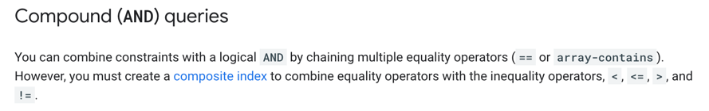

# firestore-utils

API for fetching data in Datastore dynamically in json format.

## Environment variables
PROJECT_ID = Project ID in GCP <br/>

## Endpoints

**POST** /query


#### Body:
- **select**: (Optional. If not send, returns whole json) Fields to be selected. The key is the name of the field in the response and the value is the name of the field in Datastore. If the field is nested, the name of the field in Datastore must be separated by dots. Example: "delivery.deliveryPC". If the field is an array, the name of the field in Datastore must be followed by the index of the array, letter N for selecting all or a condition to find a specific object within the array . 
<br/> <br/> Example:
```
{
  "select": {
    "municipalReferenceCode": "deliveryOrders[0].reservations[n].customInfo[name=municipalReferenceCode].values[0]"
  }
}
```
Will give first deliveryOrder, all reservations and the value of the first element of the array of values of the customInfo object with name municipalReferenceCode.

- **filters**: (Required field) Filter condition for the query. The field is the name of the field in Datastore. If it is nested, needs to be followed by dot. The operation is the operation to be applied and the value is the value to be compared. The operation can be one of the following: >, >=, <, <=, ==, !=. The value is the expected value to match. 
  <br/> We could have multiple filters (along datastore limitations)
    

#### Curl example
```
curl --location 'http://localhost:8080/query/:collectionName' \
--header 'Content-Type: application/json' \
--data '{
   "collection": "Collection/Document/Child-Collection",
    "select": {
        "orderNumber": "omsOrderNumber",
        "country": "attributes.country",
        "deliveryOrderNumber": "deliveryOrderNumber",
        "createdAt": "createdAt",
        "reservationChannel": "deliveryOrders[0].reservations[0].reservationChannel",
        "districts": "districts[0].f12Id",
        "municipalReferenceCode": "deliveryOrders[0].reservations[0].customInfo[name=municipalReferenceCode].values[0]",
        "deliveryPC": "delivery.deliveryPC",
        "originNode": "deliveryOrders[0].reservations[0].customInfo[name=originNode].values[0]"
    },
    "filters": [
        {
            "field": "createdAt",
            "operation": ">",
            "value": "2023-10-24"
        }
    ],
    "limit": 1000
}'
```
